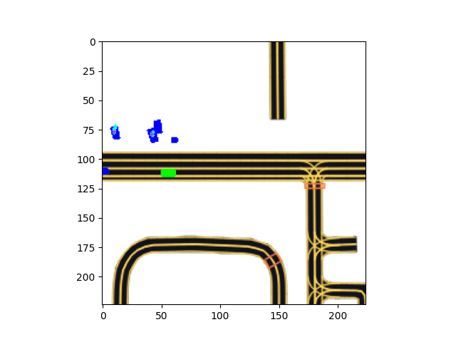

# Motion-Prediction
A motion prediction model trained on the **Lyft's Prediction Dataset** capable of predicting the motion of all agents visible to the ego vehicle at a given point in time(A frame).    

## Model 
The base model is a ***GoogLeNet*** model that is not pretrained. It is customized with multiple Fully Connected convolution layers at the output to meet the requirements to plot the predicted trajectories of the agents. The input layer is also customized to match the output size of the rasterizer. 

## Result

